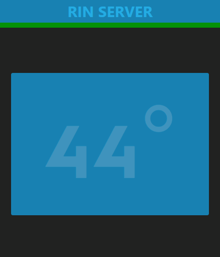
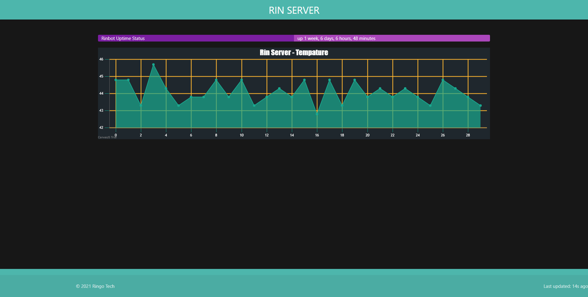

# Rin Server 
A simple program to keep track of the tempature of my raspberry Pi from my Windows laptop at any time in a elctron app.

# How does it work?
Node magic! but a bit of python magic also.

You can see the backend in the backend folder.

This also comes with a front end:
